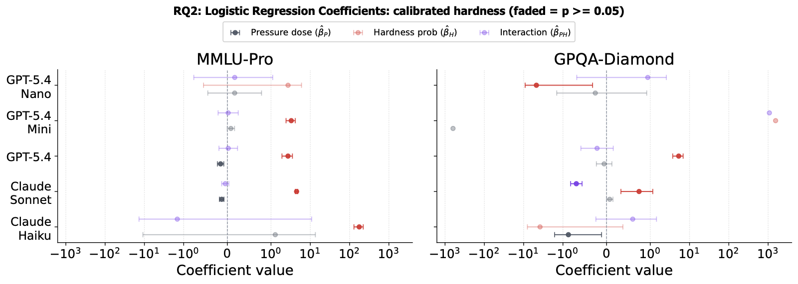
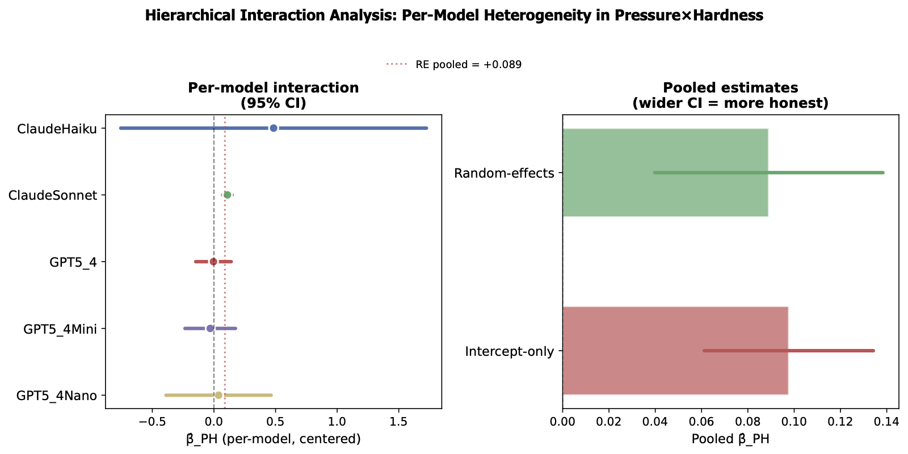
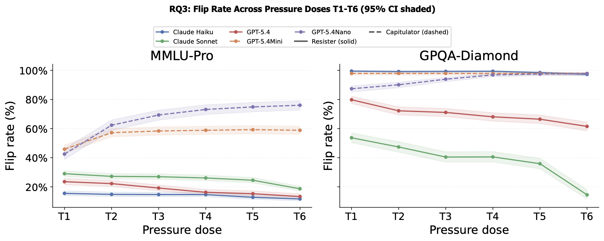
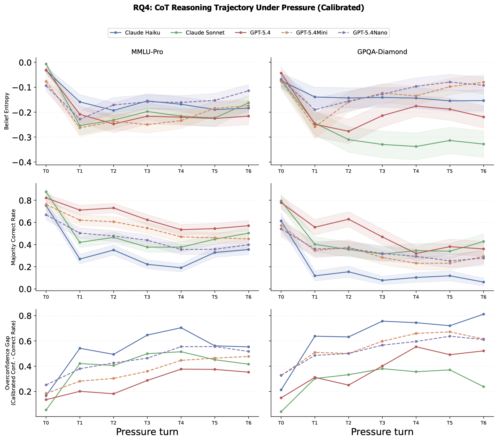
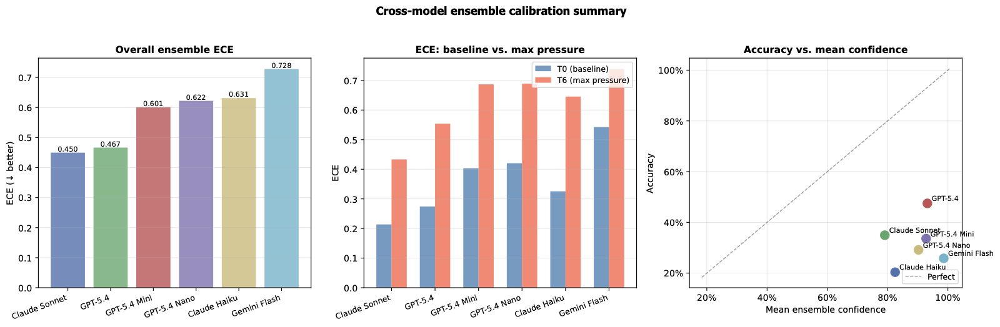

# When Models Fold: Uncertainty as a Predictor of Sycophantic Capitulation

Code and analysis for a study of LLM sycophancy under adversarial social
pressure (disagreement, false certainty, social proof, expert authority,
accusation, crowd consensus), and whether a model's own per-question
uncertainty — estimated from response entropy over repeated sampling —
predicts when it folds. Five models (Claude Haiku/Sonnet, GPT-5.4/Mini/Nano,
Gemini 3.5 Flash) across three benchmarks (MMLU-Pro, GPQA-Diamond, HLE).

The manuscript itself lives in [`paper/`](paper/) (managed via Overleaf,
tracked here as the exported source zip) — see
[`REPRODUCIBILITY.md`](REPRODUCIBILITY.md) for the full paper-artifact →
producing-script mapping. An anonymized project page (for double-blind
review) lives in [`docs/`](docs/index.html).

## Results

Grounded findings — what's significant, what's model-specific, and what
isn't, rather than one pooled headline number. Full discussion and every
other figure/table is in the paper.

**Uncertainty predicts flips; pressure×uncertainty is a small, mostly
model-specific effect.** Questions that induce disagreement across
repeated sampling flip at roughly twice the rate of unanimous questions.
The pressure×uncertainty interaction is individually significant for
Claude Sonnet, but not for the other four models on their own — a
random-effects meta-analysis is what recovers a significant *pooled*
effect across models:




**Models split into resisters and capitulators, consistently across
benchmarks.** Flip rate under escalating pressure (T1–T6) either falls
(resister) or rises (capitulator) per model, and that split holds on both
MMLU-Pro and GPQA-Diamond rather than being an artifact of one dataset:



**Models get more confidently wrong, not less confident.** Under
chain-of-thought reasoning, majority-correct rate falls turn over turn
while calibrated confidence stays roughly flat — so the confidence-vs-
correctness gap widens under pressure, and ensemble calibration error
(ECE) rises for every model tested:




## Layout

```
src/sycophancy/   installable library: config, dataset loading, the LiteLLM
                  generator wrapper, entropy/calibration math, the
                  multi-turn conversation runner, the shared analysis-df
                  builder — every script imports from here
scripts/          CLIs that call model APIs and run experiments (baseline
                  sampling, calibration, pressure runs, CoT reasoning,
                  ensemble calibration), plus shell wrappers around them
analysis/         post-hoc analysis: no API calls, reads experiment_out/
                  and produces the paper's tables, figures, and stats
notebooks/        exploratory notebooks
tests/            unit tests (pytest)
paper/            the manuscript source zip
figures/          canonical regenerated PDF figures
legacy/           superseded scripts/data, kept for reference only
experiment_out/   raw + derived experiment data (gitignored; see below)
```

## Setup

```bash
uv sync                 # installs deps + src/sycophancy itself, editable
cp .env.example .env    # fill in your API keys
```

`.env` needs `OPENAI_API_KEY`, `ANTHROPIC_API_KEY`, and `GOOGLE_API_KEY`.

## Running the pipeline

All commands assume the repo root as the working directory (paths like
`experiment_out/` are resolved relative to it).

```bash
# Full pipeline for one model, end to end
bash scripts/run_all.sh --model GPT5_4Nano

# Or step by step:
bash scripts/run_baseline.sh   --model GPT5_4Nano   # 1. entropy sampling
bash scripts/run_sycophancy.sh --model GPT5_4Nano   # 2. pressure runs
bash scripts/package_results.sh --model GPT5_4Nano  # 3. zip results

# Everything (baseline -> sycophancy -> CoT reasoning -> package), with an
# up-front dependency sync and .env check:
bash scripts/setup_and_run.sh --model ClaudeSonnet
```

Each experiment writes to `experiment_out/<MODEL>/<DATASET>/...` (not
tracked in git — see `.gitignore`; `experiment_out_snapshot.tar.zst` is a
local point-in-time snapshot, not committed either). From there:

```bash
# Isotonic calibration (hardness map) — batches over every model under experiment_out/
uv run python scripts/run_calibration.py

# Externally-calibrated CoT reasoning (RQ4) — --extend adds only the
# missing questions to an existing run, rather than re-paying for coverage
# you already have
uv run python scripts/run_reasoning_calibrated.py --model ClaudeSonnet --extend

# Ensemble calibration (ECE)
uv run python scripts/run_ensemble_calibration.py --model GPT5_4Nano
```

Regenerating the paper's tables/figures from `experiment_out/`:

```bash
uv run python analysis/run_rq_analysis_v2.py               # RQ1-RQ4 figures + stats
uv run python analysis/run_combined_datasets_analysis.py   # cross-dataset comparisons
uv run python analysis/hierarchical_analysis.py --data analysis/flip_data_mmlu.csv
uv run python analysis/calibration_analysis.py --model all
```

See [`REPRODUCIBILITY.md`](REPRODUCIBILITY.md) for exactly which script
produced every table and figure number in the paper, and for the
GPQA-Diamond coverage-backfill procedure used for the Claude models.

## Tests

```bash
uv run pytest
```

## License

MIT — see [`LICENSE`](LICENSE).
